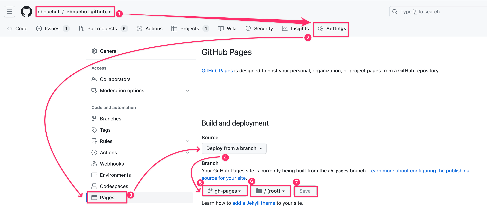

[![publish status][publish-image]][publish-url]

[My blog](https://EricBouchut.com) uses [*Mkdocs*](https://github.com/mkdocs/mkdocs) and [*mkdocs-material*](https://squidfunk.github.io/mkdocs-material/) as a blogging platform.

This git repository has 2 branches:
- **`main`** contains the source of my blog
- **`gh-pages`** contains the published version of my blog.
 
## Installation

You need[ Python3](http://docs.python-guide.org/en/latest/starting/installation/) installed

```shell
# ⓵ Install Python3 (see link above)

# ② Clone the Project
git clone git@github.com:ebouchut/ebouchut.github.io.git
cd ebouchut.github.io

# ③ Create a Python virtual environment in your project
# IMPORTANT: Do this once
python3 -m venv venv 
  
# ④ Activate the virtual environment 
# IMPORTANT: Do this each time you open a new shell/window/tab
source venv/bin/activate

# ⓹ Install the project's required packages
python -m pip install -r requirements.txt
```

Let's break down each of the steps above:
1. Install _Python_ 3.  
   Review [Properly Installing Python](http://docs.python-guide.org/en/latest/starting/installation/) for help on getting *Python* installed.
2. [Clone](https://docs.github.com/en/repositories/creating-and-managing-repositories/cloning-a-repository) this project
3. Install Python Virtual Environment.  
   In this example, I use [`venv`](https://realpython.com/python-virtual-environments-a-primer/#how-can-you-work-with-a-python-virtual-environment), but use whichever you prefer.
4. Activate the Virtual Environment.
     Do not forget this step  or else you will get errors saying that a command or a package cannot be found.  
     IMPORTANT: Activate the virtual environment once **each time you open a new shell window/tab**.
5. Install the project's required _Python_ packages

## Run

### Preview 

You can **preview** the blog **locally**  as you edit the files.

- Run the command below
  ```shell
  mkdocs serve
  ```
  This builds the website locally then runs a local web server listening on port `8000` . 
  
  If the default port (`8000`) is already used, you can use another one like `8080` for example:
  ```shell
  mkdocs serve -a 127.0.0.1:8080
  ```

  ℹ️ Keep this command running  as you make changes to the blog because it will continuously watch for file changes, build the changed files, and ask the browser to reload the updated pages.
  However, If you change the configuration file (`mkdocs.yml`), you will need to restart `mkdocs serve`.
- **Open** this URL in your **web browser**: http://127.0.0.1:8000/  
  
### Add a Blog Post

To create a new blog post:

- **Create** a new Markdown **file** under `docs/blog/posts`  with this naming convention  
  `YYYY-MM-DD-post_title_here.md`,  where:  
	- `YYYY` denotes the year number in a four-digit format (for instance `2023`) 
	- `MM` denotes the month number in a two-digit format within the `01` to `12` range (where `01` is January and `12` is December)
	- `DD` denotes the day of the month in two-digit format within the  range `01` to `31`
	- `post_title_here` denotes the title of the blog post. Separate each word with an underscore (`_`)
	- `.md`  is the Markdown file suffix
- **Edit** the blog post (for instance `docs/blog/posts/2023-08-14-post_title_here.md`).  
  Use the below documentation to learn more:
  -  [Python Markdown](https://squidfunk.github.io/mkdocs-material/setup/extensions/python-markdown/)
  - [Python Markown Extensions](https://squidfunk.github.io/mkdocs-material/setup/extensions/python-markdown-extensions/)
  - [mkdocs-material extensions](https://squidfunk.github.io/mkdocs-material/reference/)
  Most of the extensions mentioned in the docs are already installed and configured in `mkdocs.yml`.
- Commit your changes on the `main` branch and push to your `origin` repository when you are done.
  ```shell
  git add docs/blog/post/2023-08-14-post_title_here.md
  git commit -m "Add a new blog post..."
  
  git push  # origin main
  ```

### Publish

There are 2 ways to publish/deploy the blog, using one of the following methods: 
- [Command Line Interface (**CLI**)](#publish-with-cli)  
  CLI deployment is a **manual** process.  
  You must run a command to trigger the deployment.  
  You run the  `mkdocs gh-deploy` command from the local repository to build the blog from the current branch and deploy it to the repository website hosted on *GitHub*. 
- [**Continuous Integration**](#publish-with-CI)  
  CI deployment is an **automated** process that is triggered every time you push  the `main`  branch to the repository. It deploys the blog to the GitHub repository website.

**IMPORTANT**: Both methods require [GitHub Pages to be enabled and configured](#github-pages-configuration) (one-time) beforehand. 

The following sections describe these two deployment methods.

#### Publish with CLI

**Requirement**: You must first [configure *GitHub Pages* for your repository](#configure-github-pages).
 
Deployment consists of using *Mkdocs* to convert the source to the published version and sending it to GitHub, which will deploy it to your repository's GitHub website.

**Summary**  
```shell
# ⓵ Switch to the branch containing the source of the blog 
git switch main

# ② Go to the project's root directory 🤓
cd $(git rev-parse --show-toplevel)

# ③ Trigger the deployment of the current branch
mkdocs gh-deploy
```

Let's break down what is happening here:
1. `git switch main`  
   Switch to the `main` branch which contains the source of the blog.
2. Make sure you are in the project's root folder
3. `mkdocs gh-deploy`  
   - Build the blog from the current branch (`main`)
   - Place the build output in the `site` folder
   - Commit the contents of the `site` folder to the `gh-pages` branch
   - Push `gh-pages` to the `origin` remote repository on *GitHub*
   - *GitHub Pages* will notice the `gh-pages` branch has been pushed  and will automatically deploy its latest commit to your GitHub repository  website.

#### Publish with CI

**Requirements**:  
- You must first [configure *GitHub Pages* for your repository](#configure-github-pages).
- You need the [`publish.yml`](.github/workflows/publish.yml) *GitHub Action* script to automate things.  
  You already have it if you cloned this repository.

This method is **fully automated** and runs **server-side**.  
The only thing you have to do is push the `main` branch to trigger the deployment. 
```shell
git push origin main
```

**When** is CI triggered?  
This remote deployment method is triggered each time you push the `main` branch to the repository. 

**Wha**t does the CI do?  
It clones the repository, installs the required packages, builds and commit the site to the `gh-pages` branch and push `gh-pages` to the repository, which triggers its deployment to the repository Website.  

**How long** does the CI run?
Deploying the blog with the CI may take from 1 to several minutes.
To monitor what is happening, take a look at the [Github Actions](https://github.com/ebouchut/ebouchut.github.io/actions).

**Summary**  
```shell
# ⓵ Configure and enable (one-time) GitHub Pages 

# ② You need the `.github/workflow/publish.yml` GitHub Action.
# You already have it if you cloned this repository.

# ③ Push the main branch
git push origin main

# ④ Open your repository "GitHub Actions" tab on GitHub Web 
#  and watch the GitHub Action do the work for you on GitHub https://github.com/YOUR_GITHUB_USERNAME_HERE/YOUR_GITHUB_USERNAME_HERE.github.io/actions
```

The main **difference** with [`Publish with CLI`](#publish-with-cli)  is that `mkdocs-deploy` is **automatically** **launched** on the **GitHub servers** without any manual action on your part.  

#### Configure GitHub Pages

**What** is GitHub Pages?  
> **GitHub Pages** is a static site hosting service provided by GitHub that allows users to publish web pages directly from their GitHub repositories.
> It utilizes the repository content to automatically generate and serve web pages.  
> It is free of charge.

It is disabled by default and can be enabled per repository.

**How** does *GitHub Pages* work?  
> Whenever the `gh-pages` branch is pushed to your repository, *GitHub Pages* will automatically deploy its latest commit to your personal GitHub website:  
     `https://YOUR_GITHUB_USERNAME_HERE.github.io/`

Now, that you know what it is and how it works, let's **configure** and enable *GitHub Pages*:

1. Open your [blog repository](https://github.com/ebouchut/ebouchut.github.io) on GitHub  
   If you are using your own repo, the URL should rather look like so:
`https://github.com/YOUR_GITHUB_USERNAME_HERE/YOUR_GITHUB_USERNAME_HERE.github.io`
2. Click  the ⚙️ **`"Settings"`** tab (last one on the right)
3. Click **`Pages`** located under the `Code and Automation` section
4. In the **`Source`** field, select **`Deploy from a Branch`** 
5. **First** drop-down under the **`Branch`** section: Select  **`gh-pages`**
6. **Second** drop-down: Select **`"/(root)"`**
7. Click **`Save`** 

>    


<!-- Github Badges: Images and URLs -->

[publish-image]: https://github.com/ebouchut/ebouchut.github.io/actions/workflows/publish.yml/badge.svg?branch=main
[publish-url]:   https://github.com/ebouchut/ebouchut.github.io/actions/workflows/publish.yml

