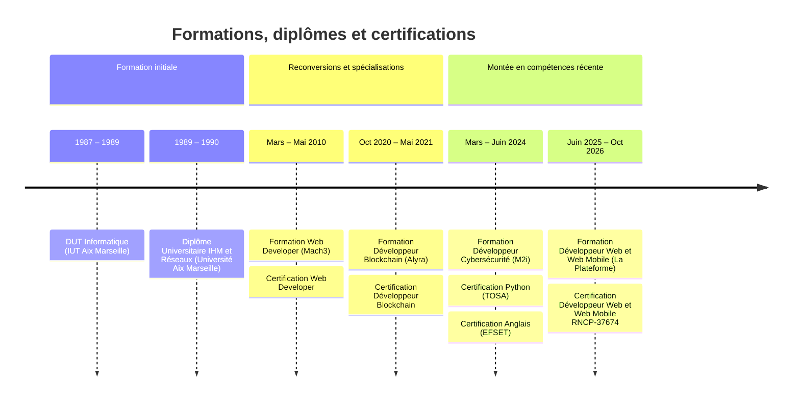

---
hide:
  - navigation
  - tags
tags:
  - CV 
  - resume 
---

# CV Eric Bouchut

### Ingénieur logiciel

- **Email** :    [EricBouchut@gmail.com](mailto:EricBouchut@gmail.com)
- **LinkedIn** : [https://linkedin.com/in/ebouchut](https://linkedin.com/in/ebouchut)
- **Blog** :     [https://EricBouchut.com](https://EricBouchut.com)

## Présentation

Ingénieur logiciel principalement backend, avec plusieurs années d'expérience en Java. Habitué au travail en équipe distribuée et virtuelle, j'ai évolué dans tous types de structures et contribué à des projets open source. J'aime expliquer, partager mes connaissances, apprendre en public et rester au fait des évolutions technologiques, notamment l'architecture logicielle qui prend tout son sens avec l'IA.

Je recherche une opportunité d'ingénieur logiciel en CDI dans la zone Aix en Provence — Marseille.

J'ai l'expérience de **Java** et **Ruby on Rails**.  

Depuis <time datetime="2023">2023</time>, je contribue aux projets **open-source** 
[Loop](https://loopdocs.org/), puis Trio avec une équipe distribuée mondiale virtuelle 
pour améliorer la **documentation technique** 
et configurer les outils utilisés pour sa création.

En <time datetime="2021">2021</time>, en tant que développeur Solidity pour le projet open-source [Bet-no-loss](https://github.com/bet-no-loss/bet-no-loss#readme),
j'ai co-écrit et documenté un smart-contract pour la **Blockchain** Ethereum pour miser sur un pari sportif sans perdre sa mise.

En tant que **professeur d'informatique** pour Axis-Digital, 
j'ai enseigné le langage C, les Appels Système **Unix** et le **Shell** 
à des groupes de 15 personnes, ainsi que le cours "*Utilisation Unix avancée*" 
que j'ai co-écrit.

J'ai rédigé plusieurs articles sur **Git**, tels que [*Git Stash Internals*](https://www.ericbouchut.com/blog/2021/07/22/git-stash-internals/) et 
[*Git Flow*](https://github.com/ebouchut/learn-git/wiki/Git-Flow).

À l'issue d'une formation en alternance de 16 mois, 
j'ai obtenu la certification **Développeur Web et Web Mobile**.

**Compétences clés** :

- Java, Spring Boot, Spring MVC, 
- Ruby, Ruby on Rails,
- Programmation Shell,
- Git, Conventional Commits, 
- intégration et déploiement en continu avec des GitHub Workflows,
- documentation technique, formation.

**Soft Skills** :

- Curiosité technique, 
- rigueur et organisation,
- pédagogie et communication écrite,
- esprit d'équipe.

## Expériences professionnelles

### Contributeur Open Source pour Loop et Trio

- **Projets open-source** : *Loop* et *Trio* :globe_with_meridians:{ title="Télétravail" }
- **Dates** : Depuis <time datetime="2023">2023</time>

> La documentation de *Loop* et *Trio* a pour but 
> de fournir des instructions et ressources 
> pour les professionnels de santé et les utilisateurs 
> de ces système automatisés d'administration d'insuline 
> pour les personnes atteintes de Diabète de Type 1.

Contributions aux projets [LoopDocs](https://loopdocs.org) et [TrioDocs](https://triodocs.org/) sur GitHub :

- amélioration de la **documentation** d'installation, de configuration et d'utilisation de ces logiciels,
- configuration des outils utilisés pour construire et publier les sites Web,
- collaboration à distance avec une équipe géographiquement distribuée dans le monde entier.

**Compétences utilisées** :

- [mkdocs](https://www.mkdocs.org/) le moteur utilisé pour générer les sites Web statiques qui documentent ces projets,
- [mkdocs-material](https://squidfunk.github.io/mkdocs-material/) pour les chromes au-dessus du moteur *mkdocs*: thème, moteur de recherche, 
- [pip](https://github.com/pypa/pip#readme) pour la **gestion des dépendances** *Python*,
- [venv](https://realpython.com/python-virtual-environments-a-primer/#how-can-you-work-with-a-python-virtual-environment): un **environnement virtuel Python** pour isoler les dépendances du projet.
- [GitHub Workflows](https://github.com/nightscout/trio-docs/tree/dev/.github/workflows) (**CI, CD**) pour l'intégration et le déploiement en continu de la documentation, 
- **GitHub Project**, [Issues](https://github.com/nightscout/trio-docs/issues?q=is:issue%20state:closed%20author:ebouchut) et [PRs](https://github.com/nightscout/trio-docs/pulls?q=is:pr+is:closed+author:ebouchut).

### Développeur Backend

- **Entreprise** : [HostnFly](https://www.hostnfly.com/) (Paris :globe_with_meridians:{ title="Télétravail" })
- **Dates** : <time datetime="2022-04">Avril 2022</time> - 
          <time datetime="2022-10">Octobre 2022</time>

> *HostnFly* est une startup B2C dans l'industrie de l'hébergement de voyage.

Développement et maintenance du Back-Office de conciergerie
pour mettre des logements en location sur Airbnb et BookingSync,
avec une IA qui optimise le prix de la location et sa durée.

**Compétences utilisées** : Ruby on Rails.

### Développeur Solidity

- **Entreprise** : [Alyra](https://www.alyra.fr/) (Paris :globe_with_meridians:{ title="Télétravail" })
- **Dates** : <time datetime="2021-01">Janvier 2021</time> - 
      <time datetime="2021-06">Juin 2021</time>

> Contribution au projet open-source **[Bet-no-loss](https://github.com/bet-no-loss/bet-no-loss#readme)** constitué de 5 personnes.  
> Création d'une application distribuée sur la Blockchain Ethereum pour parier 
> sur un évènement sportif sans perdre sa mise.
> Ce projet a été réalisé dans le cadre de la formation *Développeur Blockchain*  chez Alyra.

- développement du backend en Solidity,
- documentation du projet,
- configuration du build et de la CI/CD avec des GitHub Workflows et **Heroku**

**Compétences utilisées** :

- Solidity,
- Smart Contracts Ethereum, 
- GitHub Workflows, 
- Heroku.

### Développeur Ruby on Rails et Java — Locala

- **Entreprise** : [Locala](https://asklocala.com/fr) (Marseille)
- **Dates** : <time datetime="2017-02">Mars 2017</time> - 
      <time datetime="2020-11">Novembre 2020</time> (3 ans et 10 mois)

> Locala (anciennement S4M) apporte des solutions publicitaires
> pour aider les marques à générer des visites supplémentaires
> dans leurs magasins physiques et en-ligne.

- Réalisation d'une API REST pour exposer le DSP comme un service,
- amélioration de la documentation,
- création d'une base de connaissances technique ainsi qu'un manuel *git-flow* qui a servi de référence aux développeurs,
- support de niveau 3 chargé de diagnostiquer les problèmes techniques.

**Compétences utilisées** :

- Java,
- Ruby,
- Ruby on Rails,
- Confluence.

### Développeur Ruby on Rails et Java — LDMobile

- **Entreprise** : LDMobile (Marseille)
- **Dates** : <time datetime="2014-01">Janvier 2014</time> -
      <time datetime="2017-02">Février 2017</time> (3 ans et 2 mois)

> LD Mobile a créé NetADge, un DSP mobile en libre-service qui permet aux annonceurs d'acheter
> des emplacements publicitaires pour téléphone mobile de manière programmatique et ciblée
> selon différents critères tels que géolocalisation, démographie, centres d'intérêt, comportement.

En tant que développeur full-stack dans une équipe de 9 personnes,
j'ai travaillé à la fois sur le front-office avec Ruby on Rails et sur le back-end en Java.
Vu que la publicité programmatique (RTB) implique le traitement d'un très grand nombre de requêtes et données,
j'ai également utilisé des outils et frameworks big-data tels que *Storm*, *Cassandra* et *Kafka*.

**Compétences utilisées** : 

- Open-RTB (publicité programmatique),
- Ruby,
- Java,
- Ruby on Rails,
- Redis,
- Storm,
- Cassandra,
- Kafka.

### Développeur Web

- **Entreprise** : Antidot (Lambesc)
- **Dates** : <time datetime="2010-06">Juin 2010</time> -
      <time datetime="2013-12">Décembre 2013</time> (3 ans et 7 mois)

> Antidot est un moteur de recherche privé qui fournit aux entreprises 
> une plateforme de diffusion de contenu pour les
> aider à organiser et partager leurs connaissances.

- Conception et réalisation d'une librairie de widgets qui s'intègrent dans une page Web
  pour interroger le moteur de recherche, filtrer et afficher les résultats.  
  Le produit phare d'Antidot, [Fluid Topics](http://fluidtopics.com),
  utilise à l'heure actuelle cette technologie.

**Compétences utilisées** : 

- Java,
- GWT (Google Web Toolkit),
- XSL,
- PHP,
- Jira.

1991 — 2009

### Expériences antérieures (1991 — 2009)

#### Software Developer

- **Entreprise** : Miyowa (Marseille)
- **Dates** : <time datetime="2008-02">Février 2008</time> -
      <time datetime="2009-08">Août 2009</time> (1 an et 7 mois)

> *Miyowa* unifie messageries instantanées et e-mails au sein d'une seule interface.

- Création du logiciel de collecte des statistiques d'utilisation de la passerelle Java 
  reliant les applications mobiles (SFR, NRJ) aux services de messagerie instantanée, 
  e-mails et réseaux sociaux.

**Compétences utilisées** : Java, JMS, Jira.

#### Product Developer

- **Entreprise** : BMC Software (Aix-en-Provence)
- **Dates** : <time datetime="2001-04">Avril 2001</time> -
      <time datetime="2008-01">Janvier 2008</time> (6 ans et 10 mois)

> *BMC Software* édite des solutions de gestion et de supervision
> des systèmes d'information (IT Operations & Service Management)
> pour les grandes entreprises.

- Réalisation de modules de découverte des environnements :
    - J2EE (WebLogic et WebSphere) via JMX,
    - Web services,
    - Business Processes (Oracle BPEL Manager),
- Travail en équipe géographiquement distribuée (Etats-Unis, Israël, Inde, France).

**Compétences utilisées** : 

- Java,
- JMX, 
- Jenkins, 
- travail en équipe distribuée, 
- anglais.

#### Développeur Web, Webmaster, Ingénieur logiciel Java

- **Entreprise** : Perform (Aix-en-Provence)
- **Dates** : <time datetime="1997-10">Octobre 1997</time> -
      <time datetime="2001-03">Mars 2001</time> (3 ans et 6 mois)

> Perform  offre des solutions de découverte et d'administration de réseaux X25 et TCP/IP.

- Conception et réalisation du logiciel de gestion de la clientèle (CRM Web based) en *ColdFusion*,
- gestion et évolution du site Web,
- contribution au développement d'un logiciel de découverte et visualisation de la topologie réseau TCP/IP.

**Compétences utilisées** :

-  Java,
-  HTML,
-  développement du site et d'applications Web,
-  ColdFusion

#### Ingénieur logiciel C++ et Java

- **Entreprise** : AL'X (Lyon)
- **Dates** : <time datetime="1994-11">Novembre 1994</time> -
      <time datetime="1997-09">Septembre 1997</time> (2 ans et 11 mois)

> AL'X est une ESN travaillant principalement avec l'Assistance Publique-Hôpitaux de Paris.

Développement d'une application qui préfigurait ce qui est devenu plus tard 
la gestion du dossier médical informatisé.

**Compétences utilisées** : C++, Java, X11.

#### Ingénieur logiciel MINITEL et Audiotel

- **Entreprise** : CLV Maintenance Système (Paris)
- **Dates** : <time datetime="1994-04">Avril 1994</time> -
      <time datetime="1994-10">Octobre 1994</time> (7 mois)

> *CLV Maintenance Système* conçoit des services télématiques (MINITEL)
> et vocaux (Audiotel).

Réalisation d'applications back-end MINITEL et Audiotel ainsi qu'un moteur de traitement des requêtes en *langage
  naturel* à l'aide de Lex et Yacc.

**Compétences utilisées** :

- C, 
- Perl, 
- Awk, 
- Lex, 
- Yacc, 
- Shell Unix.

#### Formateur informatique

- **Entreprise** : Axis Digital (Boulogne Billancourt)
- **Dates** : <time datetime="1991-01">Janvier 1991</time> - 
          <time datetime="1994-03">Mars 1994</time> (3 ans et 3 mois)

> *Axis Digital* est un organisme de formation en informatique,
> spécialisé dans les langages de programmation, le système Unix, X11 et TCP/IP.

- Enseignement des cours *Langage C*, *Utilisation Unix* et *Appels Système Unix*,
- conception puis enseignement du cours *Utilisation – Unix avancé*,
- maintenance et évolution d'un logiciel d'émulation MINITEL.

**Compétences utilisées** :

- C, 
- appels système Unix, 
- Shell, 
- documentation technique.

## Formations et diplômes

### Formation en alternance Développeur Web et Web Mobile

- **Organisme** : [La Plateforme](https://laplateforme.io/)
- **Dates** : <time datetime="2025-06">Juin 2025</time> - <time datetime="2026-10">Octobre 2026</time> (16 mois)

> Formation en alternance menant au titre professionnel de Développeur Web et Web Mobile (RNCP niveau 5).

**Compétences** : 

- front-end Web: [HTML, CSS](https://github.com/ebouchut-laplateforme/project-html-css-form#layout), Javascript, 
- back-end: Java, Spring Boot, Spring MVC, Spring Data JPA, Spring Security, API REST, 
- base de données: MySQL et [PostgreSQL](https://github.com/ebouchut/learn-dev?tab=contributing-ov-file#database), 
- Conteneurisation avec **[Docker](https://github.com/ebouchut/learn-dev?tab=readme-ov-file#package-for-production-docker)** et **[Docker Compose](https://github.com/ebouchut/learn-dev?tab=readme-ov-file#docker-terminology)**, 
- gestion de projet: [GitHub Project](https://github.com/users/ebouchut/projects/7), [Issues](https://github.com/ebouchut/learn-dev/issues?q=is:issue%20state:closed), [Pull-Requests](https://github.com/ebouchut/learn-dev/pulls?q=is:pr+is:closed)
- Méthodologie Agile, Scrum, KanBan.

### Formation Développeur Cybersécurité

- **Organisme** : [M2i Formation](https://www.m2iformation.fr)
- **Dates** : <time datetime="2024-03">Mars 2024</time> - <time datetime="2024-06">Juin 2024</time>

> La formation certifiante **Développeur Cybersécurité** (POEC) chez *M2i Formation* 
> m'a permis d'appréhender les techniques de sécurisation des systèmes et des applications.
> Elle couvre un large éventail de compétences, allant des bonnes pratiques 
> de sécurité (DevSecOps) à l'administration des systèmes Linux et Windows, le Pentest 
> et la programmation sécurisée en Python.

**Compétences** :

- Cybersécurité, 
- Python, 
- SQL,
- sécurisation des serveurs et applications Web

### Formation Développeur Blockchain

- **Organisme** : [Alyra l'école Blockchain et IA](https://www.alyra.fr/)
- **Dates** : <time datetime="2020-10">Octobre 2020</time> - <time datetime="2021-05">Mai 2021</time>

> Développement d'applications distribuées sur la Blockchain Ethereum.

**Compétences** : Blockchain Ethereum, Smart Contracts.

### Formation Web Developer

- **Organisme** : Mach3 (Groupe Ingenium)
- **Dates** : <time datetime="2010-03">Mars 2010</time> - <time datetime="2010-05">Mai 2010</time>

> Acquisition des fondamentaux du développement Web avec HTML, CSS et Javascript

**Compétences** : HTML, CSS, JavaScript.

### Diplôme Universitaire mention Interface Hommes Machines et Réseaux

- **Organisme** : Université Aix Marseille
- **Dates** : <time datetime="1989">1989</time> - <time datetime="1990">1990</time>

> Formation universitaire post-DUT approfondissant la programmation système 
> sous Unix, l’écriture de scripts Shell 
> et les fondamentaux des réseaux TCP/IP.

**Compétences** :

- Appels systèmes Unix, 
- Programmation Shell, 
- fondamentaux des protocoles IP et TCP,
- X11.

### DUT Informatique

- **Organisme** : IUT Aix Marseille
- **Dates** : <time datetime="1987">1987</time> - <time datetime="1989">1989</time>

>Formation supérieure de deux ans posant les fondamentaux de l'informatique : 
>algorithmique, programmation en C et Pascal, système Unix et réseaux TCP/IP. 
>Certaines de ces fondations me sont toujours utiles aujourd’hui.

**Compétences** :

- Algorithmie, 
- langages C et Pascal, 
- programmation Shell, 
- système Unix, 
- réseaux et TCP/IP.

## Certifications

- **Développeur Web et Web Mobile**, titre professionnel RNCP-37674 (août 2026),
- [**Python**](https://www.tosa.org/FR/Index?param=azRnM2xNUHBkQjJyelEyVmMzRWlrdVVWUVIyeDY2d3JYbVRIMHM0YWFxSGo3THRxMmtoMnl5OFV5TWhGcWl5dU1VcjBWU0R5a3VLZkpBM2wrWUxnWnc9PTo6p7f1rU0XpWZtu8CsGdXzCA) (*TOSA* juin 2024),
- [**Anglais**](https://cert.efset.org/4ybGYX) (*EFSET* mars 2024),
- [**Développeur Blockchain**](https://certificate.bcdiploma.com/check/8AEFB8EA0140B750A45B5C30C13E2F320F2D746A07337296DAB5FF4D23789757ZmlaRlRBZHB6NTJtVEdObFQ1RUt4MEllUFJQRVRGYWxnZEx4Qjl6QmF1Y2Y0Wkll) (*Alyra* mai 2021),
- **Web Developer** (*Mach3* mai 2010).

## Langues

- **Anglais** (niveau C1)
- **Français** (langue maternelle)

