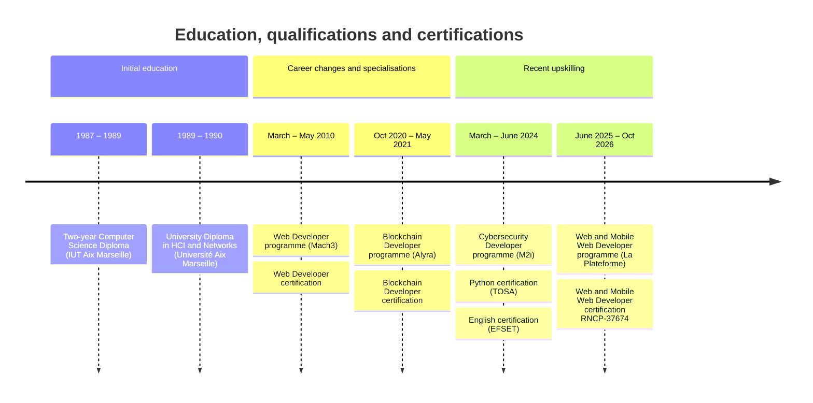

---
hide:
  - navigation
  - tags
tags:
  - CV
  - resume
---

# Eric Bouchut — Résumé

### Software Engineer

- **Email** :    [EricBouchut@gmail.com](mailto:EricBouchut@gmail.com)
- **LinkedIn** : [https://linkedin.com/in/ebouchut](https://linkedin.com/in/ebouchut)
- **Blog** :     [https://EricBouchut.com](https://EricBouchut.com)

## Profile

Software engineer, mainly backend, with several years of Java experience. Used to working in distributed, remote teams, I have worked in organisations of every size and contributed to open source projects. I enjoy explaining, sharing what I know, learning in public, and keeping up with how the field evolves — software architecture in particular, which takes on a new meaning with AI.

I am looking for a permanent software engineering position in the Aix-en-Provence — Marseille area.

I have hands-on experience with **Java** and **Ruby on Rails**.

Since <time datetime="2023">2023</time> I have contributed to the **open-source** projects
[Loop](https://loopdocs.org/), then Trio, within a globally distributed remote team,
improving their **technical documentation**
and configuring the tooling used to produce it.

In <time datetime="2021">2021</time>, as a Solidity developer on the open-source project [Bet-no-loss](https://github.com/bet-no-loss/bet-no-loss#readme),
I co-wrote and documented a smart contract on the Ethereum **blockchain** for betting on a sports event without losing your stake.

As a **computer science teacher** at Axis-Digital,
I taught the C language, **Unix** system calls and the **shell**
to groups of 15, along with the *Advanced Unix Usage* course
that I co-wrote.

I have written several articles about **Git**, such as [*Git Stash Internals*](../posts/2021-07-22-git-stash-internals.md) and
[*Git Flow*](https://github.com/ebouchut/learn-git/wiki/Git-Flow).

At the end of a 16-month work-study programme,
I earned the **Web and Mobile Web Developer** qualification.

**Core skills**:

- Java, Spring Boot, Spring MVC,
- Ruby, Ruby on Rails,
- shell programming,
- Git, Conventional Commits,
- continuous integration and delivery with GitHub Workflows,
- technical documentation, teaching.

**Soft skills**:

- technical curiosity,
- rigour and organisation,
- teaching ability and written communication,
- teamwork.

## Professional experience

### Open Source Contributor to Loop and Trio

- **Open-source projects** : *Loop* and *Trio* :globe_with_meridians:{ title="Remote" }
- **Dates** : Since <time datetime="2023">2023</time>

> The *Loop* and *Trio* documentation aims
> to provide instructions and resources
> for healthcare professionals and users
> of these automated insulin delivery systems
> for people living with type 1 diabetes.

Contributions to the [LoopDocs](https://loopdocs.org) and [TrioDocs](https://triodocs.org/) projects on GitHub:

- improving the **documentation** covering installation, configuration and day-to-day use of this software,
- configuring the tooling used to build and publish the websites,
- remote collaboration with a team distributed across the world.

**Skills used**:

- [mkdocs](https://www.mkdocs.org/), the engine generating the static websites that document these projects,
- [mkdocs-material](https://squidfunk.github.io/mkdocs-material/) for everything layered on top of *mkdocs*: theme, search engine,
- [pip](https://github.com/pypa/pip#readme) for *Python* **dependency management**,
- [venv](https://realpython.com/python-virtual-environments-a-primer/#how-can-you-work-with-a-python-virtual-environment): a **Python virtual environment** isolating the project's dependencies.
- [GitHub Workflows](https://github.com/nightscout/trio-docs/tree/dev/.github/workflows) (**CI, CD**) for continuous integration and deployment of the documentation,
- **GitHub Project**, [Issues](https://github.com/nightscout/trio-docs/issues?q=is:issue%20state:closed%20author:ebouchut) and [PRs](https://github.com/nightscout/trio-docs/pulls?q=is:pr+is:closed+author:ebouchut).

### Backend Developer

- **Company** : [HostnFly](https://www.hostnfly.com/) (Paris :globe_with_meridians:{ title="Remote" })
- **Dates** : <time datetime="2022-04">April 2022</time> -
          <time datetime="2022-10">October 2022</time>

> *HostnFly* is a B2C startup in the travel accommodation industry.

Development and maintenance of the concierge back-office
used to list properties on Airbnb and BookingSync,
with an AI optimising rental price and duration.

**Skills used** : Ruby on Rails.

### Solidity Developer

- **Company** : [Alyra](https://www.alyra.fr/) (Paris :globe_with_meridians:{ title="Remote" })
- **Dates** : <time datetime="2021-01">January 2021</time> -
      <time datetime="2021-06">June 2021</time>

> Contribution to the open-source project **[Bet-no-loss](https://github.com/bet-no-loss/bet-no-loss#readme)**, a team of 5.
> Creation of a distributed application on the Ethereum blockchain for betting
> on a sports event without losing your stake.
> This project was carried out as part of the *Blockchain Developer* programme at Alyra.

- backend development in Solidity,
- project documentation,
- build and CI/CD configuration with GitHub Workflows and **Heroku**

**Skills used**:

- Solidity,
- Ethereum smart contracts,
- GitHub Workflows,
- Heroku.

### Ruby on Rails and Java Developer — Locala

- **Company** : [Locala](https://asklocala.com/fr) (Marseille)
- **Dates** : <time datetime="2017-02">March 2017</time> -
      <time datetime="2020-11">November 2020</time> (3 years 10 months)

> Locala (formerly S4M) provides advertising solutions
> helping brands drive additional visits
> to their physical and online stores.

- built a REST API exposing the DSP as a service,
- improved the documentation,
- created a technical knowledge base as well as a *git-flow* handbook that became the developers' reference,
- level 3 support, diagnosing technical issues.

**Skills used**:

- Java,
- Ruby,
- Ruby on Rails,
- Confluence.

### Ruby on Rails and Java Developer — LDMobile

- **Company** : LDMobile (Marseille)
- **Dates** : <time datetime="2014-01">January 2014</time> -
      <time datetime="2017-02">February 2017</time> (3 years 2 months)

> LD Mobile built NetADge, a self-service mobile DSP letting advertisers buy
> mobile ad placements programmatically and target them
> on criteria such as geolocation, demographics, interests and behaviour.

As a full-stack developer in a team of 9,
I worked both on the front office with Ruby on Rails and on the backend in Java.
Since programmatic advertising (RTB) involves processing very large volumes of requests and data,
I also used big-data tools and frameworks such as *Storm*, *Cassandra* and *Kafka*.

**Skills used** :

- Open-RTB (programmatic advertising),
- Ruby,
- Java,
- Ruby on Rails,
- Redis,
- Storm,
- Cassandra,
- Kafka.

### Web Developer

- **Company** : Antidot (Lambesc)
- **Dates** : <time datetime="2010-06">June 2010</time> -
      <time datetime="2013-12">December 2013</time> (3 years 7 months)

> Antidot is a private search engine company providing businesses
> with a content delivery platform helping them
> organise and share their knowledge.

- Designed and built a library of widgets embedded in a web page
  to query the search engine, filter and display results.  
  Antidot's flagship product, [Fluid Topics](http://fluidtopics.com),
  still uses this technology today.

**Skills used** :

- Java,
- GWT (Google Web Toolkit),
- XSL,
- PHP,
- Jira.

Earlier experience: 1991 — 2009

### Earlier experience (1991 — 2009)

#### Software Developer

- **Company** : Miyowa (Marseille)
- **Dates** : <time datetime="2008-02">February 2008</time> -
      <time datetime="2009-08">August 2009</time> (1 year 7 months)

> *Miyowa* unifies instant messaging and email in a single interface.

- Built the software collecting usage statistics for the Java gateway
  connecting mobile applications (SFR, NRJ) to instant messaging,
  email and social network services.

**Skills used** : Java, JMS, Jira.

#### Product Developer

- **Company** : BMC Software (Aix-en-Provence)
- **Dates** : <time datetime="2001-04">April 2001</time> -
      <time datetime="2008-01">January 2008</time> (6 years 10 months)

> *BMC Software* publishes IT management and monitoring solutions
> (IT Operations & Service Management)
> for large enterprises.

- Built discovery modules for:
    - J2EE (WebLogic and WebSphere) via JMX,
    - web services,
    - business processes (Oracle BPEL Manager),
- Worked in a geographically distributed team (United States, Israel, India, France).

**Skills used** :

- Java,
- JMX,
- Jenkins,
- distributed teamwork,
- English.

#### Web Developer, Webmaster, Java Software Engineer

- **Company** : Perform (Aix-en-Provence)
- **Dates** : <time datetime="1997-10">October 1997</time> -
      <time datetime="2001-03">March 2001</time> (3 years 6 months)

> Perform offered discovery and administration solutions for X25 and TCP/IP networks.

- Designed and built the web-based CRM software in *ColdFusion*,
- managed and evolved the website,
- contributed to software for discovering and visualising TCP/IP network topology.

**Skills used**:

-  Java,
-  HTML,
-  website and web application development,
-  ColdFusion

#### C++ and Java Software Engineer

- **Company** : AL'X (Lyon)
- **Dates** : <time datetime="1994-11">November 1994</time> -
      <time datetime="1997-09">September 1997</time> (2 years 11 months)

> AL'X is an IT services company working mainly with Assistance Publique-Hôpitaux de Paris.

Development of an application that prefigured what later became
the computerised medical record.

**Skills used** : C++, Java, X11.

#### MINITEL and Audiotel Software Engineer

- **Company** : CLV Maintenance Système (Paris)
- **Dates** : <time datetime="1994-04">April 1994</time> -
      <time datetime="1994-10">October 1994</time> (7 months)

> *CLV Maintenance Système* designs videotex (MINITEL)
> and voice (Audiotel) services.

Built MINITEL and Audiotel backend applications as well as a *natural language*
  query processing engine using Lex and Yacc.

**Skills used**:

- C,
- Perl,
- Awk,
- Lex,
- Yacc,
- Unix shell.

#### IT Trainer

- **Company** : Axis Digital (Boulogne Billancourt)
- **Dates** : <time datetime="1991-01">January 1991</time> -
          <time datetime="1994-03">March 1994</time> (3 years 3 months)

> *Axis Digital* is an IT training organisation
> specialising in programming languages, Unix, X11 and TCP/IP.

- Taught the *C Language*, *Unix Usage* and *Unix System Calls* courses,
- designed then taught the *Advanced Unix Usage* course,
- maintained and evolved MINITEL emulation software.

**Skills used**:

- C,
- Unix system calls,
- shell,
- technical documentation.

## Education and qualifications

### Web and Mobile Web Developer programme

- **Institution** : [La Plateforme](https://laplateforme.io/)
- **Dates** : <time datetime="2025-06">June 2025</time> - <time datetime="2026-10">October 2026</time> (16 months)

> Work-study programme leading to the *Développeur Web et Web Mobile* professional qualification (RNCP level 5).

[Portfolio submitted for the qualification](https://github.com/ebouchut/bouchut-eric-dossiers-pros-DWWM#readme)

**Skills** :

- web front end: [HTML, CSS](https://github.com/ebouchut-laplateforme/project-html-css-form#layout), Javascript,
- back end: Java, Spring Boot, Spring MVC, Spring Data JPA, Spring Security, REST API,
- databases: MySQL and [PostgreSQL](https://github.com/ebouchut/learn-dev?tab=contributing-ov-file#database),
- containerisation with **[Docker](https://github.com/ebouchut/learn-dev?tab=readme-ov-file#package-for-production-docker)** and **[Docker Compose](https://github.com/ebouchut/learn-dev?tab=readme-ov-file#docker-terminology)**,
- project management: [GitHub Project](https://github.com/users/ebouchut/projects/7), [Issues](https://github.com/ebouchut/learn-dev/issues?q=is:issue%20state:closed), [Pull requests](https://github.com/ebouchut/learn-dev/pulls?q=is:pr+is:closed)
- Agile methodology, Scrum, Kanban.

### Cybersecurity Developer programme

- **Institution** : [M2i Formation](https://www.m2iformation.fr)
- **Dates** : <time datetime="2024-03">March 2024</time> - <time datetime="2024-06">June 2024</time>

> The certified **Cybersecurity Developer** programme (POEC) at *M2i Formation*
> gave me a working grasp of how systems and applications are secured.
> It covers a broad range of skills, from security best practices
> (DevSecOps) to Linux and Windows system administration, pentesting
> and secure programming in Python.

**Skills**:

- cybersecurity,
- Python,
- SQL,
- securing servers and web applications

### Blockchain Developer programme

- **Institution** : [Alyra, the blockchain and AI school](https://www.alyra.fr/)
- **Dates** : <time datetime="2020-10">October 2020</time> - <time datetime="2021-05">May 2021</time>

> Development of distributed applications on the Ethereum blockchain.

**Skills** : Ethereum blockchain, smart contracts.

### Web Developer programme

- **Institution** : Mach3 (Ingenium Group)
- **Dates** : <time datetime="2010-03">March 2010</time> - <time datetime="2010-05">May 2010</time>

> Learning the fundamentals of web development with HTML, CSS and Javascript

**Skills** : HTML, CSS, JavaScript.

### University Diploma in Human-Machine Interfaces and Networks

- **Institution** : Université Aix Marseille
- **Dates** : <time datetime="1989">1989</time> - <time datetime="1990">1990</time>

> Post-diploma university programme going deeper into Unix systems
> programming, shell scripting
> and TCP/IP networking fundamentals.

**Skills**:

- Unix system calls,
- shell programming,
- IP and TCP protocol fundamentals,
- X11.

### Two-year Computer Science Diploma (DUT Informatique)

- **Institution** : IUT Aix Marseille
- **Dates** : <time datetime="1987">1987</time> - <time datetime="1989">1989</time>

>Two-year higher education programme laying the fundamentals of computing:
>algorithms, programming in C and Pascal, Unix systems and TCP/IP networking.
>Some of those foundations still serve me today.

**Skills**:

- algorithms,
- C and Pascal,
- shell programming,
- Unix,
- networking and TCP/IP.

## Certifications

- **Web and Mobile Web Developer**, RNCP-37674 professional qualification (August 2026),
- [**Python**](https://www.tosa.org/FR/Index?param=azRnM2xNUHBkQjJyelEyVmMzRWlrdVVWUVIyeDY2d3JYbVRIMHM0YWFxSGo3THRxMmtoMnl5OFV5TWhGcWl5dU1VcjBWU0R5a3VLZkpBM2wrWUxnWnc9PTo6p7f1rU0XpWZtu8CsGdXzCA) (*TOSA* June 2024),
- [**English**](https://cert.efset.org/4ybGYX) (*EFSET* March 2024),
- [**Blockchain Developer**](https://certificate.bcdiploma.com/check/8AEFB8EA0140B750A45B5C30C13E2F320F2D746A07337296DAB5FF4D23789757ZmlaRlRBZHB6NTJtVEdObFQ1RUt4MEllUFJQRVRGYWxnZEx4Qjl6QmF1Y2Y0Wkll) (*Alyra* May 2021),
- **Web Developer** (*Mach3* May 2010).

## Languages

- **English** (C1)
- **French** (native)
